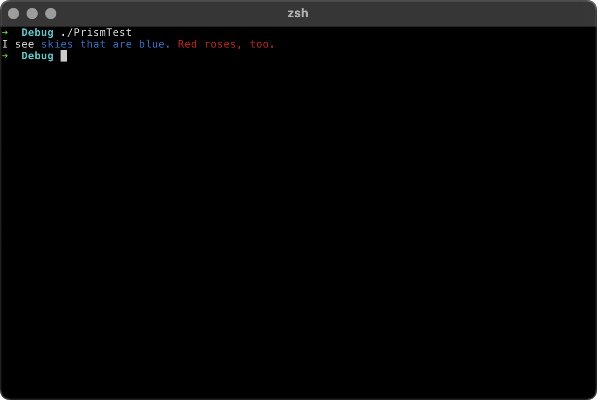

<h1 align='center'>
    <br>
    
    <br>
    <br>
</h1>

[](https://github.com/jordanbaird/Prism/actions/workflows/test.yml)
[](https://codecov.io/gh/jordanbaird/Prism)
[](https://swiftpackageindex.com/jordanbaird/Prism)
[](https://swiftpackageindex.com/jordanbaird/Prism)
[](https://github.com/jordanbaird/Prism/releases/latest)
[](https://github.com/jordanbaird/Prism/blob/main/LICENSE)

[](https://github.com/jordanbaird/Prism)

## About

`Prism` is a DSL that uses declarative syntax to create beautiful formatted text for Swift command line tools. It's powerful, easy to use, and supports both macOS and Linux.

## Install

Add the following dependency to your `Package.swift` file:

```swift
.package(url: "https://github.com/jordanbaird/Prism", from: "0.0.9")
```

## Usage

[Read the full documentation here](https://swiftpackageindex.com/jordanbaird/Prism/documentation)

Start by creating an instance of the `Prism` type. Its initializer accepts a closure, which you populate with various attributes.

```swift
let text = Prism(spacing: .spaces) {
    ForegroundColor(.green, "This text's color is green.")
    Bold("This text is bold.")
    Italic("This text is italic.")
    Underline("This text is underlined.")
    Strikethrough("This text has a strikethrough.")
}
```

Attributes behave similarly to `Prism` itself, giving you the ability to nest other elements inside them. 

```swift
let text = Prism(spacing: .newlines) {
    Bold {
        "This text is bold."
        Italic("This text is bold and italic.")
        Underline("This text is bold and underlined.")
        BackgroundColor(.cyan) {
            Underline {
                "This text is bold, underlined, and has a cyan background."
                IgnoreFormatting("This text has no formatting.")
                "Back to bold and underlined, with a cyan background."
            }
        }
    }
}
```

The DSL's `ElementBuilder` implicitly wraps strings inside a special, non-modifying `Standard` attribute, allowing instances of the `String` type — including string literals — to be used inline with other elements and attributes. In the following example, the two `Prism` blocks are semantically identical.

```swift
let text1 = Prism {
    Bold("Some bold text.")
    Standard("Just regular old text.")
    Italic("Some italic text.")
}

let text2 = Prism {
    Bold("Some bold text.")
    "Just regular old text."
    Italic("Some italic text.")
}

print(text1 == text2)
// Prints: "true"
```

The `Prism` type conforms to the `CustomStringConvertible` protocol, allowing its formatted contents to be printed directly to `stdout`. If the output destination (i.e. terminal or console) does not support formatted text, the unformatted version will be automatically printed instead.

```swift
let text = Prism {
    "I see"
    ForegroundColor(.blue) {
        "skies that are blue."
    }
    ForegroundColor(.red) {
        "Red roses, too."
    }
}

print(text)
```

<div align='center'>
    
</div>

Note that some terminal clients may display certain elements differently than others. `Prism` simply provides the terminal with a set of control codes for each attribute. It is up to the terminal to determine how it will display the control codes that `Prism` provides it.

## License

Prism is licensed under the [MIT license](http://www.opensource.org/licenses/mit-license).
